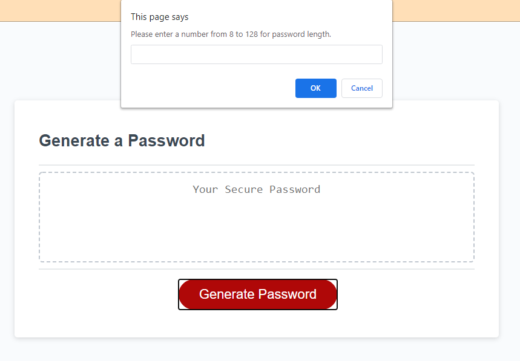
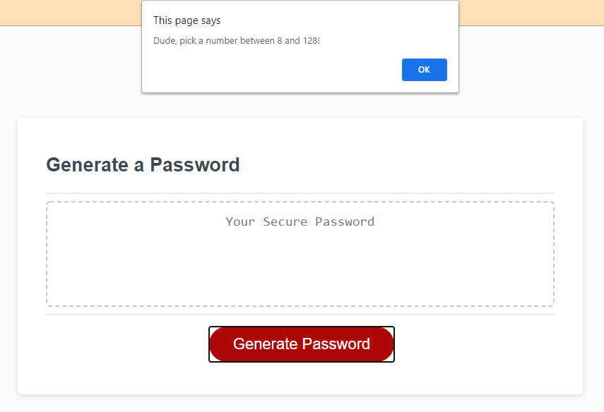
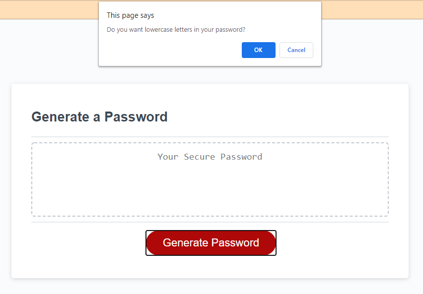
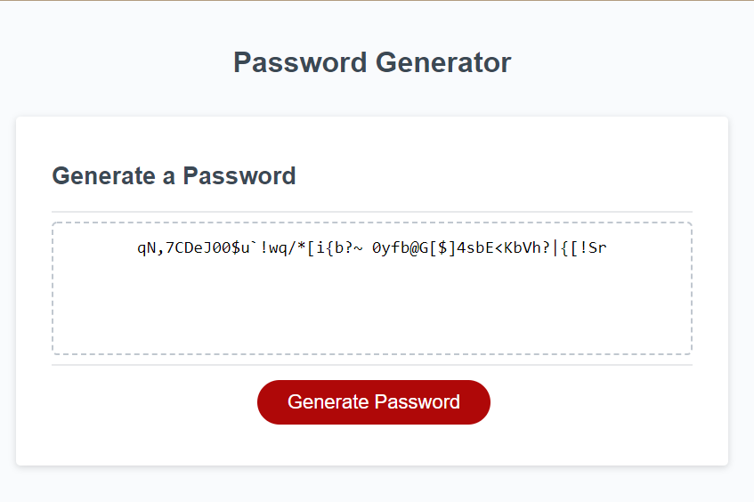

# HW3_Password_Generator

### **Objective**

My objective for this 3rd homework assignment was to create the JavaScript code to generate a new random password when the Generate Password button is clicked. The JavaScript begins by asking how long of a password the user wants, between 8 and 128 characters. Once a valid number is entered, it continues with asking whether or not the user wants lowercase, uppercase, symbols, and/or numbers in their password. As long as the user selects ok for one of the four options, a random password will populate the textbox. If none of the four character types is selected, then the user will receive an alert to select at least one and the script will stop running.

### **Challenges**

At the time I created this script, I had a difficult time with the large if/else statement to create all the logic based on the selections the user would make. I'm sure there is likely an easier way to code this out by using arrays and loops, but I just did not understand that well enough to use. The if/else statement may be long and a little difficult to follow, but it seems to work just fine. I hope to come back to this at a later date and recreate the password generator with a better method.

### **Link**

[See deployed page here](https://peterphenow.github.io/HW3_Password_Generator/)

### **Screenshots**

&nbsp;&nbsp;

&nbsp;&nbsp;
